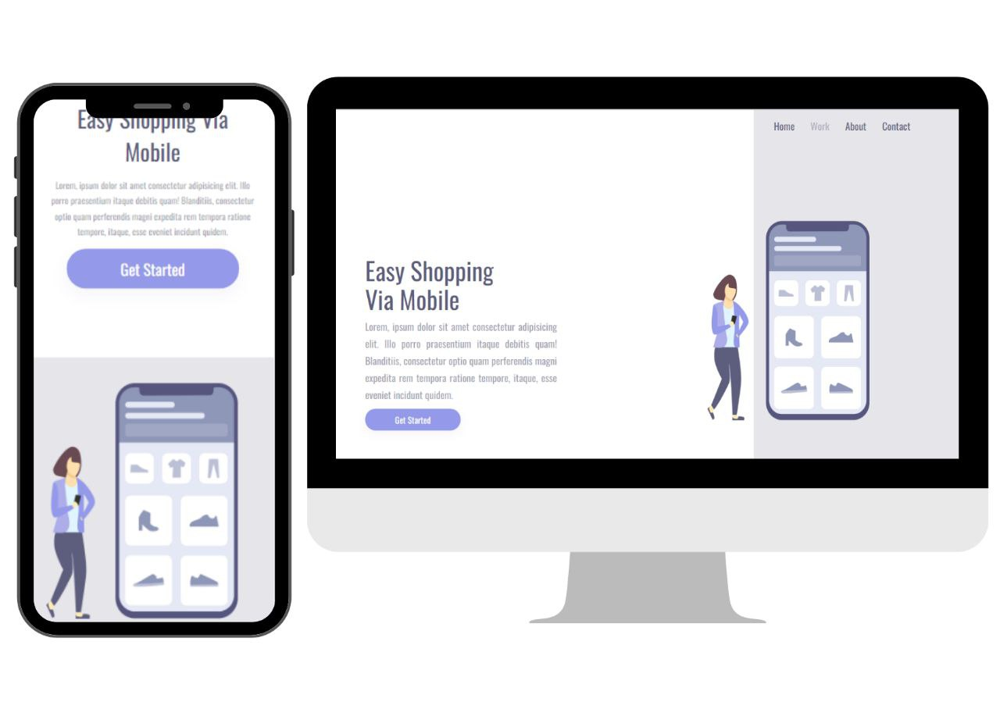
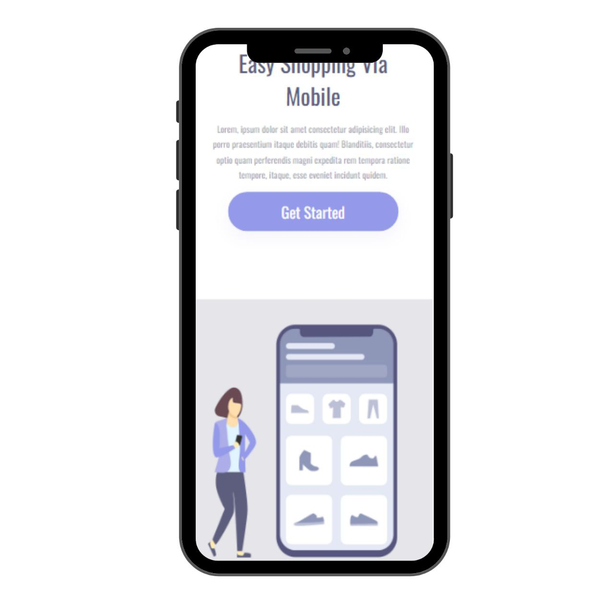
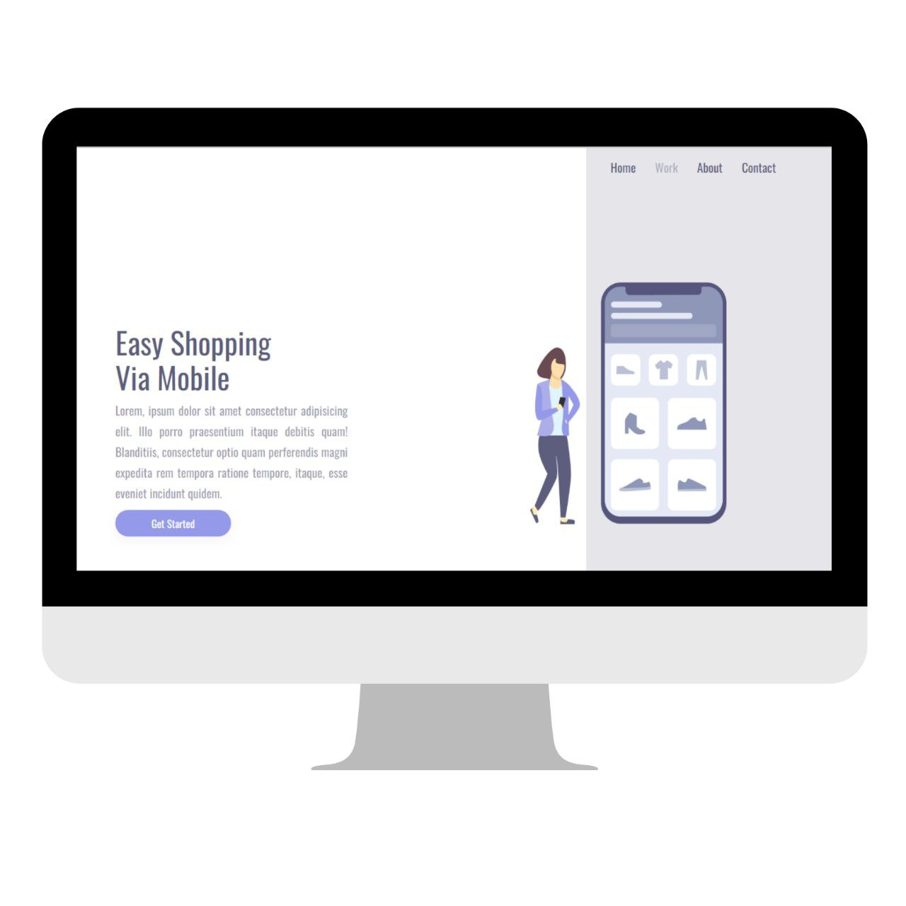

# Easy Shopping

 

  

 
 

## About the project

https://easyshoppingproject.netlify.app/

Easy Shopping is a front-end web and mobile application built during a Dev Club course class.

The application consists of a front-end website template.

### Layout mobile

  

  
 

### Layout web
  

  

  
 

## Technologies used

### Front end
- HTML
- CSS

### Deployment in production
- Front end web: Netlify

## Settings and improvements

The project is still in development and the next updates will focus on the following tasks:

- [x] Create HTML
- [x] Create CSS
- [ ] Create JavaScript
- [ ] Layout Update

## Contributors

We thank the following people who contributed to this project:

<table>
  <tr>
    <td align="center">
      <a href="#">
         
        
          <b>Daiana de Paula</b>
        
      </a>
    </td>
    
</table>

## License

 

 

